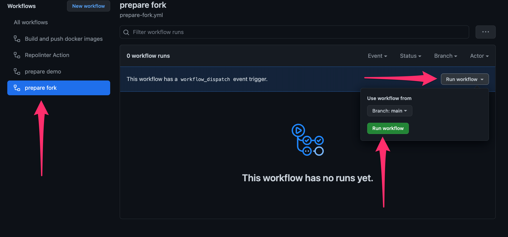

# New Relic Microservices Sandbox
### From zero to Observability while you brew coffee

A set of Terraform modules that will deploy a fully-instrumented microservices stack using AWS and New Relic.

## Installation
### Prerequisites
1. A New Relic account and License Key
2. An AWS account
3. Terraform installed

### Directions
1. Begin by *forking* this repository.  Be sure to include all branches. All work should be done from that fork.
2. In your fork, click on the "Actions" tab in the reposiory navigation.
    The first time you do this, you will be prompted with a message saying
    "Workflows aren’t being run on this forked repository".  If you wish, examine the workflows in the `.github` folder within the project. Click the button
    "I understand my workflows, go ahead and enable them".
3. Now, we'll prepare a demo branch and publish the docker images.
    1.  Click on the workflow named *prepare fork*.
    2.  On the right side of the screen, click "Run workflow", and then the green "Run workflow" button.
    
    3.  Once the workflow completes, navigate to your repository's homepage.  You should see that you have a new branch named "demo" as well as some published packages (right side of the screen).
4. Follow [these instructions](https://docs.github.com/en/repositories/configuring-branches-and-merges-in-your-repository/managing-branches-in-your-repository/changing-the-default-branch#changing-the-default-branch) to change your default branch to the one named "demo" that you just created.
5. `clone` your forked repo to your local machine.  It should fetch and checkout the "demo" branch, since you made it the default. From here on out, you'll be working locally in that branch to create infrastructure and configure Kubernetes to use the images you just published.
6. cd into the `terraform` directory
7. make a copy of the file `terraform.tfvars.sample` and rename it `terraform.tfvars`
8. Open the file and edit the variables for your own configuration and deployment.
    
    _Notes_: The Terraform module uses the [AWS resource provider](https://registry.terraform.io/providers/hashicorp/aws/latest/docs)
    to create AWS resources on your behalf. In order to do this, it must be configured properly with credentials, region, etc.
    There are several ways you can do this - using environment variables, or if you have installed the AWS cli, the Terraform provider
    will use the credentials stored in you home dir, as well as several other methods.  Configuring the module is out of the scope
    of this doc.  Recommend reading the link above to use the method that works best for you.

    Similarly, your New Relic license and API keys are used in several places and are provided as a standard Terraform variables.  You
    may set them in the .tfvars file for convenience, or you can use any of the standard methods for setting and overriding variables
    according to the [Terraform docs](https://www.terraform.io/language/values/variables#variables-on-the-command-line)
9. run `terraform init`
10. When you are ready to deploy, run `terraform apply`.  Terraform will provide a list of all of the resources its going to create
    and will prompt you for confirmation

    _Notes_:  This is going to create a 3-node Kubernetes cluster in EKS, an ALB, a VPC, and all of the necessary supporting
    resources (roles, auto-scaling groups, etc).
    
    All resources will be tagged with `project=<your cluster name>` and `owner=<owner>`
    that you provided in the configuration, should you need to identify them outside of Terraform.  Currently, [tags will not cascade down through an autoscaling group created by a managed eks nodegroup](https://github.com/aws/containers-roadmap/issues/608) to the individual EC2 instances within.  However, they will be tagged with the AWS standard tags, such as the cluster name and the EKS nodegroup name.
    
    The default limit for the number of VPCs in each region per AWS account is usually in the single digits.  If you are using
    a shared account, it's possible that you may run into this limit.  In that case, recommend choosing another region,
    or requesting a quota increase.
11. After 20-30 minutes, your cluster should be completely deployed.  Terraform will display the output from the module, which will
    include the hostname of the loadbalancer as well as the path to the kubeconfig file it created, should you want to interface with the
    cluster directly via `kubectl`, etc.  At any time you can run `terraform output` from this directory to view those values.  Note that
    Terraform will have created a `terraform.tfstate` file.  This is how Terraform keeps track of what it has deployed.  Don't
    delete this file, otherwise Terraform will not be able to clean up!
12. Run `terraform destroy` when you are done, and all created resources will be removed.

## Getting Started

This stack consists of three microservices that work together to serve information about Superheroes:
1. The [Superhero service](./apps/superheroes/).  This is the core RESTful API that houses all of the superhero information.  All of the data is stored in an in-memory database
2. The [Customers service](./apps/customers/).  An API that stores information about customers who want to get information about superheroes using our API.  Mainly performs authentication.  Backed by a containerized MySQL instance
3. The [Gateway service](./apps/gateway/).  Serves mainly as a proxy to the Superhero service, but will attempt to authorize requests via HTTP headers before fetching superhero data.

Additionally, there is a [load generator](./apps/loadgen/) that is deployed to the cluster, but is not currently instrumented.

You can visit the loadbalancer host in a browser and you should be directed to the OpenApi/Swagger documentation for the API.  Also serves as a playground to see how the it works.

Visit your account in [New Relic](https://one.newrelic.com) to observe the mircroservices working together, complete with Service Maps, Kubernetes Cluster Explorer, Distributed Tracing, and Logs-in-Context.

One of the terraform outputs is a link to a workload in your account containing all of the entities created by this configuration - a handy shortcut to started exploring the stack.

Alternatively, you can use the global filter in [New Relic Explorer](https://docs.newrelic.com/docs/new-relic-solutions/new-relic-one/core-concepts/new-relic-explorer-view-performance-across-apps-services-hosts/#filter-tag) to filter for `project = <whatever your cluster name is> OR clusterName = <whatever your cluster name is>`

## Building

If you want experiment with, or make changes to this stack, you generally have two options:

- Edit and deploy locally using Docker Compose.  There is a `docker-compose` file in the root of the [apps](./apps/) directory.  This will deploy a single instance of each app, but it will bypass all of [configuration that is handled by terraform and helm](./terraform/kubernetes-objects/applications.tf), so there won't be any New Relic instrumentation; just the apps.

- Edit locally and deploy to AWS via GitHub Actions.  This is functionally the same as if you followed the installation directions above, except you will be deploying from _your own_ GitHub repository.  

  This project has a [GitHub workfow](.github/workflows/build-push-image.yml) that will execute every time a change within any of the application dirs is pushed to `main`, or when a tag is created with a semver format prefixed with "v" (ex: `v1.0.1`).  A docker image will be built for any changed apps and pushed to the GitHub Container Registry of the user who pushed the change (specifically, the [`github.actor`](https://docs.github.com/en/actions/learn-github-actions/contexts)).  

  By *forking* this repo, you'll have a remote GitHub repo and container registry to build and host the images.  
  
  After forking & cloning, a typical workflow would be:  
    1. Make local changes
    2. Commit
    3. Create a new tag in the semver format (ex: `v1.0.2`)
    4. Push your changes to your fork
    5. Followed by the tag you just created (ex: `git push v1.0.2`)
    6. Wait for the build actions to complete.
    The first time you do this, you'll have to make the published packages [publicly visible](https://docs.github.com/en/packages/learn-github-packages/configuring-a-packages-access-control-and-visibility#configuring-visibility-of-container-images-for-your-personal-account), otherwise your EKS cluster won't be able to pull them. 
    7. Edit the `Chart.yml` files within the [charts](./charts/) directory for each of the apps you want to redeploy.  Increment the `version` property.  This forces helm m to run.  Change the `appVersion` property to the tag that you created in step 3.  This gets passed through to the Kubernetes yml as the version of the container to deploy.
    8. Run `terraform apply` as described in the installation instructions above.
    9. Optionally, you can commit & push the changes to the Chart.yml files but rember that terraform works _locally_, sending API commands to your EKS cluster to pull the images that live in your GitHub container registry.  Changes to these files don't automatically trigger a deployment.

## Contributing
We encourage your contributions to improve New Relic Microservices Sandbox! Keep in mind when you submit your pull request, you'll need to sign the CLA via the click-through using CLA-Assistant. You only have to sign the CLA one time per project.
If you have any questions, or to execute our corporate CLA, required if your contribution is on behalf of a company,  please drop us an email at opensource@newrelic.com.

**A note about vulnerabilities**

As noted in our [security policy](../../security/policy), New Relic is committed to the privacy and security of our customers and their data. We believe that providing coordinated disclosure by security researchers and engaging with the security community are important means to achieve our security goals.

If you believe you have found a security vulnerability in this project or any of New Relic's products or websites, we welcome and greatly appreciate you reporting it to New Relic through [HackerOne](https://hackerone.com/newrelic).

## License
New Relic Microservices Sandbox is licensed under the [Apache 2.0](http://apache.org/licenses/LICENSE-2.0.txt) License.
